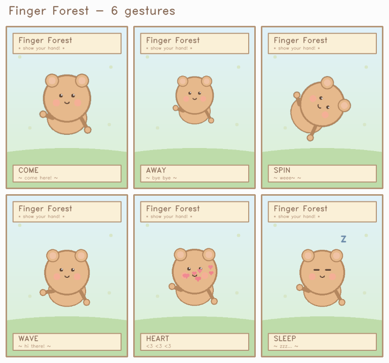
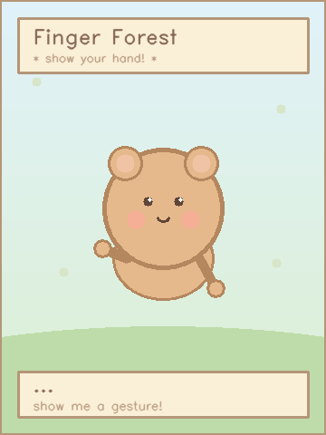
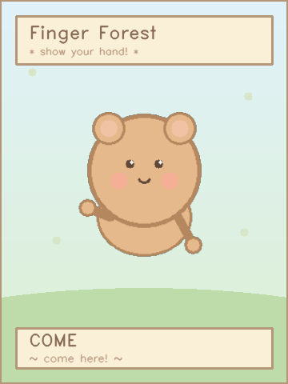
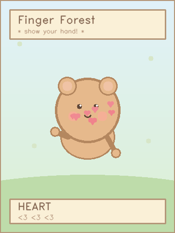

# 🌲 Hand Forest

> Animal-Crossing-flavored hand gesture recognition.
> **Webcam → MediaPipe → LSTM → a tiny pastel hub that reacts to your fingers.**

<p align="center">
  
</p>

Draw a gesture in the air and a little forest friend responds in real-time: it
pops up when you call it, shrinks away when you shoo it, spins, waves, blows
hearts, or falls asleep.

Built on top of the classic
[kairess/gesture-recognition](https://github.com/kairess/gesture-recognition)
pipeline (MediaPipe 21-landmark hand → 30-frame sequence → LSTM classifier),
extended from 3 to 6 gestures and dressed up with a cute Animal-Crossing-style
reaction panel.

---

## ✨ Features

| Gesture | Meaning        | Hub reaction                                    |
| :-----: | :------------- | :---------------------------------------------- |
| `come`  | *come here!*   | Character **pops up from below** with a bounce  |
| `away`  | *bye-bye*      | Character **shrinks and drifts away**           |
| `spin`  | *weee~*        | Character **rotates 360°** on the grass         |
| `wave`  | *hi there!*    | Character **waves its arm** side-to-side        |
| `heart` | *I love you*   | **Hearts float up** around the character        |
| `sleep` | *zzz…*         | Eyes close, **Z Z Z** rise above the character  |

- 🎥 **Real-time** inference on a CPU-only laptop (~30 fps with a webcam).
- 🧠 **LSTM over MediaPipe landmarks** — lightweight and fast to re-train.
- 🎨 **Pastel hub UI** drawn with plain OpenCV primitives — no asset files needed.
- 📦 **Reproducible** — one `requirements.txt`, relative paths, works on Win/macOS/Linux.

---

## 🗂 Project structure

```
gesture-recognition/
├── 250422_create_dataset.py   # ① collect 30s of webcam data per gesture
├── 250422_train.ipynb         # ② train the LSTM (loads every seq_*.npy via glob)
├── 250422_test.py             # ③ live webcam demo with Animal-Crossing hub
├── requirements.txt
├── assets/                    # README screenshots
├── dataset/                   # raw_*.npy + seq_*.npy (created by step ①)
├── models/                    # 250422_model.h5 (created by step ②)
└── README.md
```

Older reference scripts (`create_dataset.py`, `260422_test.py`,
`models/260422_model.h5`) are kept in the repo as a baseline.

---

## 🚀 Quickstart

### 1. Clone & create a fresh virtual env

```bash
git clone <your-fork-url>
cd gesture-recognition

python -m venv .venv
# Windows PowerShell:
#   .\.venv\Scripts\Activate.ps1
# macOS / Linux:
#   source .venv/bin/activate

pip install --upgrade pip
pip install -r requirements.txt
```

> Tested with **Python 3.10 / 3.11**. TensorFlow is pinned to `2.15.0` because
> the notebook uses Keras-2-style APIs.

### 2. Collect training data

```bash
python 250422_create_dataset.py
```

The window will cycle through the 6 gestures, spending **30 seconds per
gesture**. Hold your hand in front of the webcam and perform the gesture the
whole time. Press `q` to abort.

Output goes to `dataset/`:

```
dataset/
├── raw_come_<timestamp>.npy   seq_come_<timestamp>.npy
├── raw_away_<timestamp>.npy   seq_away_<timestamp>.npy
├── raw_spin_<timestamp>.npy   seq_spin_<timestamp>.npy
├── raw_wave_<timestamp>.npy   seq_wave_<timestamp>.npy
├── raw_heart_<timestamp>.npy  seq_heart_<timestamp>.npy
└── raw_sleep_<timestamp>.npy  seq_sleep_<timestamp>.npy
```

Re-run the script whenever you want more variety — the notebook automatically
picks up every `seq_*.npy` in `dataset/`.

### 3. Train

Open the notebook and run every cell top-to-bottom:

```bash
jupyter notebook 250422_train.ipynb
```

It loads all `seq_*.npy` via `glob`, splits 80/20, trains a small
`LSTM(64) → Dense(32) → Dense(6, softmax)` model for 200 epochs, and saves the
best checkpoint to `models/250422_model.h5`.

### 4. Run the live demo

```bash
python 250422_test.py
```

You should see your webcam feed on the left and the pastel hub on the right:

<p align="center">
  
  &nbsp;
  
  &nbsp;
  
</p>

Press `q` to quit.

---

## 🧩 How it works

```
 webcam frame ─▶ MediaPipe Hands (21 landmarks × (x,y,z,visibility))
                        │
                        ▼
              joint angles (15 values between finger bones)
                        │
                        ▼
            rolling buffer of the last 30 frames
                        │
                        ▼
              LSTM(64) ─▶ Dense(32) ─▶ softmax(6)
                        │
                        ▼
   gesture confirmed only if the same class wins 3 frames in a row
                        │
                        ▼
              Hub.trigger(action) ─▶ animation
```

The Animal-Crossing hub itself is a stateless `Hub` class: every frame it
redraws a 360×480 canvas using `cv2.ellipse / cv2.circle / cv2.warpAffine`,
with easing functions (`ease_out_back`, `ease_in_cubic`, `ease_in_out_sine`)
driving the current animation's scale / offset / rotation. See
`250422_test.py`.

---

## 🛠 Troubleshooting

<details>
<summary><b>❌ <code>FileNotFoundError: models/250422_model.h5</code> when running the test</b></summary>

You haven't trained yet. Run steps 2 and 3 first.
</details>

<details>
<summary><b>❌ MediaPipe install fails on Python 3.12+</b></summary>

MediaPipe's prebuilt wheels lag behind the newest Python releases. Use
Python 3.10 or 3.11.
</details>

<details>
<summary><b>❌ <code>cv2.VideoCapture(0)</code> can't open the camera</b></summary>

Another app is holding the webcam, or your OS needs to grant camera permission
to your terminal/IDE. Close Zoom/Teams/etc. and try again.
</details>

<details>
<summary><b>⚠️ Low accuracy on my own gestures</b></summary>

- Record more data (run `250422_create_dataset.py` multiple times — the
  notebook automatically picks up every `seq_*.npy`).
- Make the gestures visually distinct: different motion paths, not just
  different final hand shapes, because the model looks at 30 frames of motion.
- Check the confusion matrix cell at the bottom of the notebook to see which
  pair of gestures is getting confused.
</details>

---

## 🙏 Credits

- Base gesture-recognition pipeline:
  [`kairess/gesture-recognition`](https://github.com/kairess/gesture-recognition) (MIT)
- Hand landmark model: [Google MediaPipe Hands](https://developers.google.com/mediapipe/solutions/vision/hand_landmarker)
- Vibes: *Animal Crossing* 🍃

## 📄 License

MIT — see [`LICENCE`](LICENCE).
